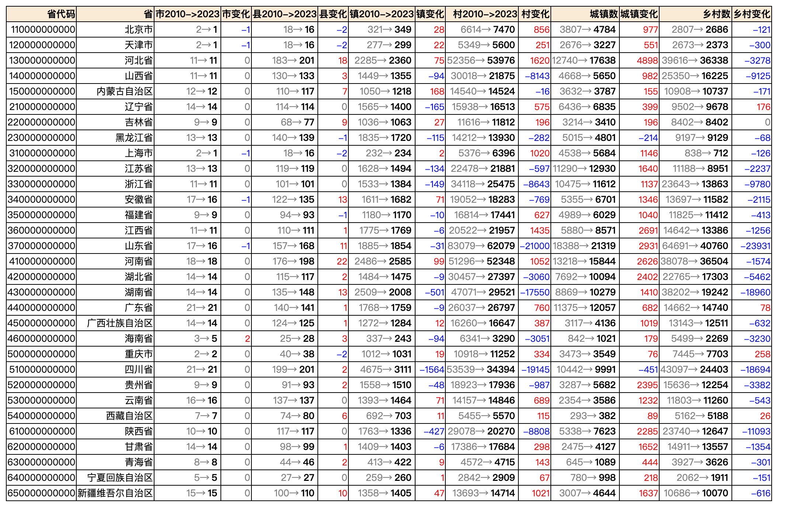

# 2023年中国全国5级行政区划（省、市、县、镇、村）

* 数据来源 中华人民共和国国家统计局 http://www.stats.gov.cn/tjsj/tjbz/tjyqhdmhcxhfdm/2022/index.html
* 最新数据量 664483 （2022年10月31日）
* CSV格式 area_code_2023.csv.gz
* SQL格式 area_code_2023.sql.gz
* JSON格式 单JSON格式太大就不生成了
* 建议级联操作，数据量确实太大了
* 级别
  * 1级：省、直辖市、自治区
  * 2级：地级市
  * 3级：市辖区、县（旗）、县级市、自治县（自治旗）、特区、林区
  * 4级：镇、乡、民族乡、县辖区、街道
  * 5级：村、居委会
* 城乡分类 (1开头是城镇，2开头是乡村)
  * 111表示主城区；
  * 112表示城乡接合区；
  * 121表示镇中心区；
  * 122表示镇乡接合区；
  * 123表示特殊区域；
  * 210表示乡中心区；
  * 220表示村庄


|     代码     |       省份       |   市  |   县   |    镇   |    村    |
|--------------|------------------|-------|--------|---------|----------|
| 110000000000 |      北京市      |   1   |   16   |   349   |   7470   |
| 120000000000 |      天津市      |   1   |   16   |   299   |   5600   |
| 130000000000 |      河北省      |   11  |  201   |   2360  |  53976   |
| 140000000000 |      山西省      |   11  |  133   |   1355  |  21875   |
| 150000000000 |   内蒙古自治区   |   12  |  117   |   1218  |  14524   |
| 210000000000 |      辽宁省      |   14  |  114   |   1400  |  16513   |
| 220000000000 |      吉林省      |   9   |   77   |   1063  |  11812   |
| 230000000000 |     黑龙江省     |   13  |  139   |   1720  |  13930   |
| 310000000000 |      上海市      |   1   |   16   |   234   |   6396   |
| 320000000000 |      江苏省      |   13  |  119   |   1494  |  21881   |
| 330000000000 |      浙江省      |   11  |  101   |   1384  |  25475   |
| 340000000000 |      安徽省      |   16  |  135   |   1682  |  18283   |
| 350000000000 |      福建省      |   9   |   93   |   1170  |  17441   |
| 360000000000 |      江西省      |   11  |  111   |   1769  |  21957   |
| 370000000000 |      山东省      |   16  |  168   |   1854  |  62079   |
| 410000000000 |      河南省      |   18  |  198   |   2585  |  52348   |
| 420000000000 |      湖北省      |   14  |  117   |   1475  |  27397   |
| 430000000000 |      湖南省      |   14  |  148   |   2008  |  29521   |
| 440000000000 |      广东省      |   21  |  141   |   1759  |  26797   |
| 450000000000 |  广西壮族自治区  |   14  |  125   |   1284  |  16647   |
| 460000000000 |      海南省      |   5   |   28   |   243   |   3290   |
| 500000000000 |      重庆市      |   2   |   38   |   1031  |  11252   |
| 510000000000 |      四川省      |   21  |  201   |   3111  |  34394   |
| 520000000000 |      贵州省      |   9   |   93   |   1510  |  17936   |
| 530000000000 |      云南省      |   16  |  137   |   1464  |  14846   |
| 540000000000 |    西藏自治区    |   7   |   80   |   703   |   5570   |
| 610000000000 |      陕西省      |   10  |  117   |   1336  |  20270   |
| 620000000000 |      甘肃省      |   14  |   99   |   1403  |  17684   |
| 630000000000 |      青海省      |   8   |   46   |   422   |   4715   |
| 640000000000 |  宁夏回族自治区  |   5   |   27   |   260   |   2909   |
| 650000000000 | 新疆维吾尔自治区 |   15  |  110   |   1405  |  14714   |
|    `全国`    |     `664486`     | `342` | `3261` | `41350` | `619502` |

# 2010 - 2023 年数据对比

| 城乡分类 |  分类描述  |  2010  |  2023  |    差距   |
|----------|------------|--------|--------|-----------|
|   111    |   主城区   | 58509  | 74838  |   +16329  |
|   112    | 城乡接合区 | 20389  | 30050  |   +9661   |
|   121    |  镇中心区  | 46440  | 53157  |   +6717   |
|   122    | 镇乡接合区 | 48447  | 54413  |   +5966   |
|   123    |  特殊区域  |  6525  |  5622  |   `-903`  |
|   210    |  乡中心区  | 23198  | 11557  |  `-11641` |
|   220    |    村庄    | 496599 | 389865 | `-106734` |

从数据可以看出13年来，村庄从`519797` 减少 `118375` 到 `401422`，减少了 22.77%，相应的城镇数量`+37820`。
大量人口从农村进入城镇，城镇化率大幅提升。

未来此趋势可能持续，大量的村庄将会荒废直至被合并至其他村庄或者取消行政村。

### 分省份来看2010-2023数据变化



### 按照乡村减少比例排序


|     code     |       name       | 乡村2010 | 乡村2023 | 乡村变化 |   比例   |
|--------------|------------------|----------|----------|----------|----------|
| 460000000000 |      海南省      |   5499   |   2269   |  -3230   | -58.7380 |
| 430000000000 |      湖南省      |  38202   |  19242   |  -18960  | -49.6309 |
| 610000000000 |      陕西省      |  23740   |  12647   |  -11093  | -46.7270 |
| 510000000000 |      四川省      |  43097   |  24403   |  -18694  | -43.3766 |
| 330000000000 |      浙江省      |  23643   |  13863   |  -9780   | -41.3653 |
| 370000000000 |      山东省      |  64691   |  40760   |  -23931  | -36.9928 |
| 140000000000 |      山西省      |  25350   |  16225   |  -9125   | -35.9961 |
| 420000000000 |      湖北省      |  22765   |  17303   |  -5462   | -23.9930 |
| 520000000000 |      贵州省      |  15636   |  12254   |  -3382   | -21.6296 |
| 320000000000 |      江苏省      |  11188   |   8951   |  -2237   | -19.9946 |
| 340000000000 |      安徽省      |  13697   |  11582   |  -2115   | -15.4413 |
| 310000000000 |      上海市      |   838    |   712    |   -126   | -15.0358 |
| 120000000000 |      天津市      |   2673   |   2373   |   -300   | -11.2233 |
| 620000000000 |      甘肃省      |  14911   |  13557   |  -1354   | -9.0805  |
| 360000000000 |      江西省      |  14642   |  13386   |  -1256   | -8.5781  |
| 130000000000 |      河北省      |  39616   |  36338   |  -3278   | -8.2744  |
| 630000000000 |      青海省      |   3927   |   3626   |   -301   | -7.6649  |
| 640000000000 |  宁夏回族自治区  |   2062   |   1911   |   -151   | -7.3230  |
| 650000000000 | 新疆维吾尔自治区 |  10686   |  10070   |   -616   | -5.7646  |
| 450000000000 |  广西壮族自治区  |  13143   |  12511   |   -632   | -4.8086  |
| 530000000000 |      云南省      |  11803   |  11260   |   -543   | -4.6005  |
| 110000000000 |      北京市      |   2807   |   2686   |   -121   | -4.3107  |
| 410000000000 |      河南省      |  38078   |  36504   |  -1574   | -4.1336  |
| 350000000000 |      福建省      |  11825   |  11412   |   -413   | -3.4926  |
| 150000000000 |   内蒙古自治区   |  10908   |  10737   |   -171   | -1.5677  |
| 230000000000 |     黑龙江省     |   9197   |   9129   |   -68    | -0.7394  |
| 220000000000 |      吉林省      |   8402   |   8402   |    0     |  0.0000  |
| 540000000000 |    西藏自治区    |   5162   |   5188   |    26    |  0.5037  |
| 440000000000 |      广东省      |  14662   |  14740   |    78    |  0.5320  |
| 210000000000 |      辽宁省      |   9502   |   9678   |   176    |  1.8522  |
| 500000000000 |      重庆市      |   7445   |   7703   |   258    |  3.4654  |

### 按照乡村减少数量绝对值排序


|     code     |       name       | 乡村2010 | 乡村2023 | 乡村变化 |   比例   |
|--------------|------------------|----------|----------|----------|----------|
| 370000000000 |      山东省      |  64691   |  40760   |  -23931  | -36.9928 |
| 430000000000 |      湖南省      |  38202   |  19242   |  -18960  | -49.6309 |
| 510000000000 |      四川省      |  43097   |  24403   |  -18694  | -43.3766 |
| 610000000000 |      陕西省      |  23740   |  12647   |  -11093  | -46.7270 |
| 330000000000 |      浙江省      |  23643   |  13863   |  -9780   | -41.3653 |
| 140000000000 |      山西省      |  25350   |  16225   |  -9125   | -35.9961 |
| 420000000000 |      湖北省      |  22765   |  17303   |  -5462   | -23.9930 |
| 520000000000 |      贵州省      |  15636   |  12254   |  -3382   | -21.6296 |
| 130000000000 |      河北省      |  39616   |  36338   |  -3278   | -8.2744  |
| 460000000000 |      海南省      |   5499   |   2269   |  -3230   | -58.7380 |
| 320000000000 |      江苏省      |  11188   |   8951   |  -2237   | -19.9946 |
| 340000000000 |      安徽省      |  13697   |  11582   |  -2115   | -15.4413 |
| 410000000000 |      河南省      |  38078   |  36504   |  -1574   | -4.1336  |
| 620000000000 |      甘肃省      |  14911   |  13557   |  -1354   | -9.0805  |
| 360000000000 |      江西省      |  14642   |  13386   |  -1256   | -8.5781  |
| 450000000000 |  广西壮族自治区  |  13143   |  12511   |   -632   | -4.8086  |
| 650000000000 | 新疆维吾尔自治区 |  10686   |  10070   |   -616   | -5.7646  |
| 530000000000 |      云南省      |  11803   |  11260   |   -543   | -4.6005  |
| 350000000000 |      福建省      |  11825   |  11412   |   -413   | -3.4926  |
| 630000000000 |      青海省      |   3927   |   3626   |   -301   | -7.6649  |
| 120000000000 |      天津市      |   2673   |   2373   |   -300   | -11.2233 |
| 150000000000 |   内蒙古自治区   |  10908   |  10737   |   -171   | -1.5677  |
| 640000000000 |  宁夏回族自治区  |   2062   |   1911   |   -151   | -7.3230  |
| 310000000000 |      上海市      |   838    |   712    |   -126   | -15.0358 |
| 110000000000 |      北京市      |   2807   |   2686   |   -121   | -4.3107  |
| 230000000000 |     黑龙江省     |   9197   |   9129   |   -68    | -0.7394  |
| 220000000000 |      吉林省      |   8402   |   8402   |    0     |  0.0000  |
| 540000000000 |    西藏自治区    |   5162   |   5188   |    26    |  0.5037  |
| 440000000000 |      广东省      |  14662   |  14740   |    78    |  0.5320  |
| 210000000000 |      辽宁省      |   9502   |   9678   |   176    |  1.8522  |
| 500000000000 |      重庆市      |   7445   |   7703   |   258    |  3.4654  |

### 一些有意思的数据分析

- 市这个级别比较稳定，数据变化不大
- 绝大部分省份的城镇数量都在增加，只有黑龙江（`-214`）和四川（`-451`）的城镇有所减少
- 绝大部分省份的乡村数量都在减少，只有辽宁（`+176`）、广东（`+79`）、重庆（`+258`）、西藏（`+26`）的乡村数量在增加
- 吉林省的乡村数量绝对值没有变化(TODO：需要看历史数据变化)
- 山东省减少了`-23931`个乡村，同比减少`-37%`，是减少最多的省份
- 湖南、四川、山西减少的乡村数都超过10000个
- 海南、湖南、陕西、四川、浙江的乡村减少比例排在前5，都超过`41%`的比例
----


## CSV格式

* code,name,level,pcode
* level: 省1，市2，县3，镇4，村5
* code: 12位，省2位，市2位，县2位，镇3位，村3位
* pcode: 直接父级别的code

文本内容

```bash
$ gzcat area_code_2023.csv.gz |wc -l
  664486

$ gzcat area_code_2023.csv.gz |head
110000000000,北京市,1,0,\N
110100000000,市辖区,2,110000000000,\N
110101000000,东城区,3,110100000000,\N
110101001000,东华门街道,4,110101000000,\N
110101001001,多福巷社区居委会,5,110101001000,111
110101001002,银闸社区居委会,5,110101001000,111
110101001005,东厂社区居委会,5,110101001000,111
110101001006,智德社区居委会,5,110101001000,111
110101001007,南池子社区居委会,5,110101001000,111
110101001009,灯市口社区居委会,5,110101001000,111
```

## SQL 格式

> $ gzcat area_code_2023.sql.gz |head -n 36

```sql
-- MariaDB dump 10.19  Distrib 10.5.18-MariaDB, for debian-linux-gnu (x86_64)
--
-- Host: 127.0.0.1    Database: china_area
-- ------------------------------------------------------
-- Server version	8.0.32

/*!40101 SET @OLD_CHARACTER_SET_CLIENT=@@CHARACTER_SET_CLIENT */;
/*!40101 SET @OLD_CHARACTER_SET_RESULTS=@@CHARACTER_SET_RESULTS */;
/*!40101 SET @OLD_COLLATION_CONNECTION=@@COLLATION_CONNECTION */;
/*!40101 SET NAMES utf8mb4 */;
/*!40103 SET @OLD_TIME_ZONE=@@TIME_ZONE */;
/*!40103 SET TIME_ZONE='+00:00' */;
/*!40014 SET @OLD_UNIQUE_CHECKS=@@UNIQUE_CHECKS, UNIQUE_CHECKS=0 */;
/*!40014 SET @OLD_FOREIGN_KEY_CHECKS=@@FOREIGN_KEY_CHECKS, FOREIGN_KEY_CHECKS=0 */;
/*!40101 SET @OLD_SQL_MODE=@@SQL_MODE, SQL_MODE='NO_AUTO_VALUE_ON_ZERO' */;
/*!40111 SET @OLD_SQL_NOTES=@@SQL_NOTES, SQL_NOTES=0 */;

--
-- Table structure for table `area_code_2023`
--

DROP TABLE IF EXISTS `area_code_2023`;
/*!40101 SET @saved_cs_client     = @@character_set_client */;
/*!40101 SET character_set_client = utf8 */;
CREATE TABLE `area_code_2023` (
  `code` bigint unsigned NOT NULL COMMENT '区划代码',
  `name` varchar(128) NOT NULL DEFAULT '' COMMENT '名称',
  `level` tinyint(1) NOT NULL COMMENT '级别1-5,省市县镇村',
  `pcode` bigint DEFAULT NULL COMMENT '父级区划代码',
  `category` int DEFAULT NULL COMMENT '城乡分类',
  PRIMARY KEY (`code`),
  KEY `name` (`name`),
  KEY `level` (`level`),
  KEY `pcode` (`pcode`)
) ENGINE=InnoDB DEFAULT CHARSET=utf8mb4 COLLATE=utf8mb4_0900_ai_ci;
/*!40101 SET character_set_client = @saved_cs_client */;

```

## 文件列表

- [area_code_2023.csv.gz](area_code_2023.csv.gz) 
  - MD5 (area_code_2023.csv.gz) = bd59582978111beeb70e9fb9a99d5630
- [area_code_2023.sql.gz](area_code_2023.sql.gz)
  - MD5 (area_code_2023.sql.gz) = 7a6c2499c430343ac8d1e19866d2e1d1
- [area_code_2010.csv.gz](area_code_2010.csv.gz) 
  - MD5 (area_code_2010.csv.gz) = caea79525da13ae341c176c2af0a12f5
- [area_code_2010.sql.gz](area_code_2010.sql.gz)
  - MD5 (area_code_2010.sql.gz) = c76bf44ca08f19cac6d0592375395f96
