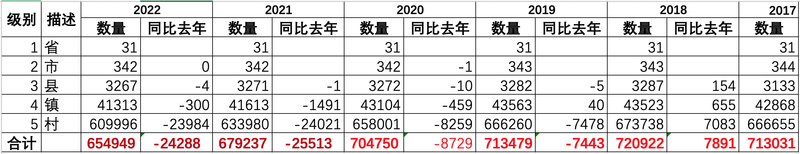

# 2022年中国全国5级行政区划（省、市、县、镇、村）

* 数据来源 中华人民共和国国家统计局 http://www.stats.gov.cn/tjsj/tjbz/tjyqhdmhcxhfdm/2021/index.html
* 最新数据量 654949 （2021年10月31日）
* CSV格式 area_code_2022.csv.gz
* SQL格式 area_code_2022.sql.gz
* JSON格式 单JSON格式太大就不生成了
* 建议级联操作，数据量确实太大了
* 级别
  * 1级：省、直辖市、自治区
  * 2级：地级市
  * 3级：市辖区、县（旗）、县级市、自治县（自治旗）、特区、林区
  * 4级：镇、乡、民族乡、县辖区、街道
  * 5级：村、居委会





## 大量村镇合并

例如：

`略`

----


## CSV格式

* code,name,level,pcode
* level: 省1，市2，县3，镇4，村5
* code: 12位，省2位，市2位，县2位，镇3位，村3位
* pcode: 直接父级别的code

文本内容

```bash
$ gzcat area_code_2022.csv.gz |wc -l
  654949

$ gzcat area_code_2022.csv.gz |head
110101001001,多福巷社区居委会,5,110101001000
110101001002,银闸社区居委会,5,110101001000
110101001005,东厂社区居委会,5,110101001000
110101001006,智德社区居委会,5,110101001000
110101001007,南池子社区居委会,5,110101001000
110101001009,灯市口社区居委会,5,110101001000
110101001010,正义路社区居委会,5,110101001000
110101001013,台基厂社区居委会,5,110101001000
110101001014,韶九社区居委会,5,110101001000
110101001015,王府井社区居委会,5,110101001000
```

## SQL 格式

> $ gzcat area_code_2022.sql.gz |head -n 38

```sql
# ************************************************************
# Sequel Ace SQL dump
# 版本号： 20021
#
# https://sequel-ace.com/
# https://github.com/Sequel-Ace/Sequel-Ace
#
# 主机: 127.0.0.1 (MySQL 5.7.29)
# 数据库: china_area
# 生成时间: 2022-01-21 19:44:55 +0000
# ************************************************************


/*!40101 SET @OLD_CHARACTER_SET_CLIENT=@@CHARACTER_SET_CLIENT */;
/*!40101 SET @OLD_CHARACTER_SET_RESULTS=@@CHARACTER_SET_RESULTS */;
/*!40101 SET @OLD_COLLATION_CONNECTION=@@COLLATION_CONNECTION */;
SET NAMES utf8mb4;
/*!40014 SET @OLD_FOREIGN_KEY_CHECKS=@@FOREIGN_KEY_CHECKS, FOREIGN_KEY_CHECKS=0 */;
/*!40101 SET @OLD_SQL_MODE='NO_AUTO_VALUE_ON_ZERO', SQL_MODE='NO_AUTO_VALUE_ON_ZERO' */;
/*!40111 SET @OLD_SQL_NOTES=@@SQL_NOTES, SQL_NOTES=0 */;


# 转储表 area_code_2022
# ------------------------------------------------------------

DROP TABLE IF EXISTS `area_code_2022`;

CREATE TABLE `area_code_2022` (
  `code` bigint(12) unsigned NOT NULL COMMENT '区划代码',
  `name` varchar(128) NOT NULL DEFAULT '' COMMENT '名称',
  `level` tinyint(1) NOT NULL COMMENT '级别1-5,省市县镇村',
  `pcode` bigint(12) DEFAULT NULL COMMENT '父级区划代码',
  PRIMARY KEY (`code`),
  KEY `name` (`name`),
  KEY `level` (`level`),
  KEY `pcode` (`pcode`)
) ENGINE=InnoDB DEFAULT CHARSET=utf8mb4;

```

> 创建视图 area_index_2022

```sql
CREATE VIEW area_index_2022 AS
    SELECT a.code,e.name AS province,d.name AS city  ,c.name AS county,b.name AS town,a.name AS villagetr
    FROM area_code_2022 a
        JOIN area_code_2022 b ON a.level=5 AND b.level=4 AND a.pcode=b.code
        JOIN area_code_2022 c ON b.pcode=c.code
        JOIN area_code_2022 d ON c.pcode=d.code
        JOIN area_code_2022 e ON d.pcode=e.code
    ORDER BY a.code
```

查询几条记录

> SELECT * FROM area_index_2022 LIMIT 10

```text
code	province	city	county	town	villagetr
110101001001	北京市	市辖区	东城区	东华门街道	多福巷社区居委会
110101001002	北京市	市辖区	东城区	东华门街道	银闸社区居委会
110101001005	北京市	市辖区	东城区	东华门街道	东厂社区居委会
110101001006	北京市	市辖区	东城区	东华门街道	智德社区居委会
110101001007	北京市	市辖区	东城区	东华门街道	南池子社区居委会
110101001009	北京市	市辖区	东城区	东华门街道	灯市口社区居委会
110101001010	北京市	市辖区	东城区	东华门街道	正义路社区居委会
110101001013	北京市	市辖区	东城区	东华门街道	台基厂社区居委会
110101001014	北京市	市辖区	东城区	东华门街道	韶九社区居委会
110101001015	北京市	市辖区	东城区	东华门街道	王府井社区居委会
```

## 三级区划的JSON格式

JSON格式，适合web端js加载。


```json
[
  {
    "code": 110000000000,
    "name": "北京市",
    "level": 1,
    "pcode": 0,
    "children": [
      {
        "code": 110100000000,
        "name": "市辖区",
        "level": 2,
        "pcode": 110000000000,
        "children": [
          {
            "code": 110101000000,
            "name": "东城区",
            "level": 3,
            "pcode": 110100000000
          },
          {
            "code": 110102000000,
            "name": "西城区",
            "level": 3,
            "pcode": 110100000000
          }
        ]
      }
    ]
  }
]
```

## 文件列表

- area_code_2022.csv.gz
- area_code_2022.sql.gz
- area_code_2022.json