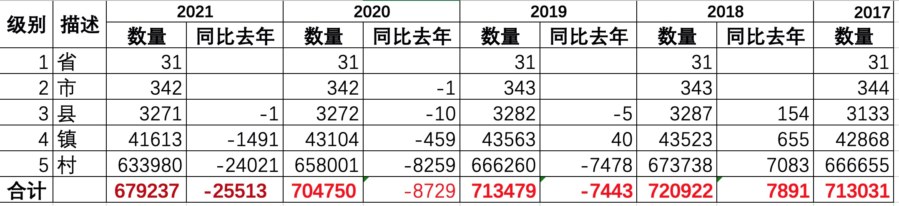
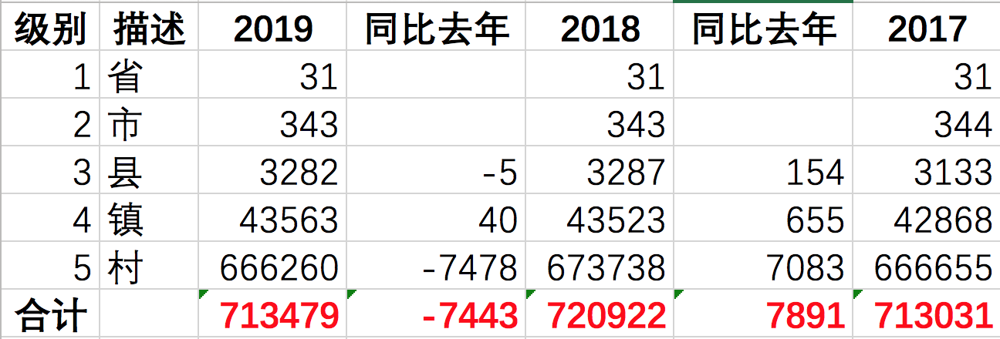

# 2021年中国全国5级行政区划（省、市、县、镇、村）

* 数据来源 中华人民共和国国家统计局 http://www.stats.gov.cn/tjsj/tjbz/tjyqhdmhcxhfdm/2020/
* 最新数据量 679237 （2020年6月30日）
* CSV格式 area_code_2021.csv.gz
* SQL格式 area_code_2021.sql.gz
* JSON格式 单JSON格式太大就不生成了
* 建议级联操作，数据量确实太大了
* 级别
  * 1级：省、直辖市、自治区
  * 2级：地级市
  * 3级：市辖区、县（旗）、县级市、自治县（自治旗）、特区、林区
  * 4级：镇、乡、民族乡、县辖区、街道
  * 5级：村、居委会





## 大量村镇合并

例如：

- 山东省/青岛市/莱西市/[院上镇](http://www.stats.gov.cn/tjsj/tjbz/tjyqhdmhcxhfdm/2020/37/02/370285.html)  2019年有[103个村子](http://www.stats.gov.cn/tjsj/tjbz/tjyqhdmhcxhfdm/2019/37/02/85/370285104.html)，到了2020年合并为[10个社区](http://www.stats.gov.cn/tjsj/tjbz/tjyqhdmhcxhfdm/2020/37/02/85/370285104.html)，少了93个村
- 山东省/青岛市/莱西市/[姜山镇](http://www.stats.gov.cn/tjsj/tjbz/tjyqhdmhcxhfdm/2020/37/02/370285.html)  2019年有[96个村子](http://www.stats.gov.cn/tjsj/tjbz/tjyqhdmhcxhfdm/2019/37/02/85/370285101.html)，到了2020年合并为[14个社区](http://www.stats.gov.cn/tjsj/tjbz/tjyqhdmhcxhfdm/2020/37/02/85/370285101.html)，少了82个村
- 山东省/聊城市/高唐县/[杨屯镇](http://www.stats.gov.cn/tjsj/tjbz/tjyqhdmhcxhfdm/2020/37/15/371526.html)  2019年有[81个村子](http://www.stats.gov.cn/tjsj/tjbz/tjyqhdmhcxhfdm/2019/37/15/26/371526109.html)，到了2020年合并为[18个社区](http://www.stats.gov.cn/tjsj/tjbz/tjyqhdmhcxhfdm/2020/37/15/26/371526109.html)，少了63个村


----

# 2020年中国全国5级行政区划（省、市、县、镇、村）

* 数据来源 中华人民共和国国家统计局 http://www.stats.gov.cn/tjsj/tjbz/tjyqhdmhcxhfdm/2019/
* 最新数据量 704750 （2019年10月31日）
* CSV格式 area_code_2020.csv.gz
* SQL格式 area_code_2020.sql.gz
* JSON格式 单JSON格式太大就不生成了
* 建议级联操作，数据量确实太大了
* 级别
  * 1级：省、直辖市、自治区
  * 2级：地级市
  * 3级：市辖区、县（旗）、县级市、自治县（自治旗）、特区、林区
  * 4级：镇、乡、民族乡、县辖区、街道
  * 5级：村、居委会




- 少了1个地级市：山东省莱芜市，被济南市合并了，做大省会的意图明显，二线城市中济南落户比较明显

---

## CSV格式

* code,name,level,pcode
* level: 省1，市2，县3，镇4，村5
* code: 12位，省2位，市2位，县2位，镇3位，村3位
* pcode: 直接父级别的code

文本内容

```bash
$ gzcat area_code_2021.csv.gz |wc -l
  679237

$ gzcat area_code_2021.csv.gz |head
110000000000,"北京市",1,0
110100000000,"市辖区",2,110000000000
110101000000,"东城区",3,110100000000
110101001000,"东华门街道",4,110101000000
110101001001,"多福巷社区居委会",5,110101001000
110101001002,"银闸社区居委会",5,110101001000
110101001005,"东厂社区居委会",5,110101001000
110101001006,"智德社区居委会",5,110101001000
110101001007,"南池子社区居委会",5,110101001000
110101001008,"黄图岗社区居委会",5,110101001000
```

## SQL 格式

> $ gzcat area_code_2021.sql.gz |head -n 38

```sql
# ************************************************************
# Sequel Ace SQL dump
# 版本号： 3024
#
# https://sequel-ace.com/
# https://github.com/Sequel-Ace/Sequel-Ace
#
# 主机: 127.0.0.1 (MySQL 5.7.29)
# 数据库: china_area
# 生成时间: 2021-04-04 07:24:01 +0000
# ************************************************************


/*!40101 SET @OLD_CHARACTER_SET_CLIENT=@@CHARACTER_SET_CLIENT */;
/*!40101 SET @OLD_CHARACTER_SET_RESULTS=@@CHARACTER_SET_RESULTS */;
/*!40101 SET @OLD_COLLATION_CONNECTION=@@COLLATION_CONNECTION */;
SET NAMES utf8mb4;
/*!40014 SET @OLD_FOREIGN_KEY_CHECKS=@@FOREIGN_KEY_CHECKS, FOREIGN_KEY_CHECKS=0 */;
/*!40101 SET @OLD_SQL_MODE='NO_AUTO_VALUE_ON_ZERO', SQL_MODE='NO_AUTO_VALUE_ON_ZERO' */;
/*!40111 SET @OLD_SQL_NOTES=@@SQL_NOTES, SQL_NOTES=0 */;


# 转储表 area_code_2021
# ------------------------------------------------------------

DROP TABLE IF EXISTS `area_code_2021`;

CREATE TABLE `area_code_2021` (
  `code` bigint(12) unsigned NOT NULL COMMENT '区划代码',
  `name` varchar(128) NOT NULL DEFAULT '' COMMENT '名称',
  `level` tinyint(1) NOT NULL COMMENT '级别1-5,省市县镇村',
  `pcode` bigint(12) DEFAULT NULL COMMENT '父级区划代码',
  PRIMARY KEY (`code`),
  KEY `name` (`name`),
  KEY `level` (`level`),
  KEY `pcode` (`pcode`)
) ENGINE=InnoDB DEFAULT CHARSET=utf8mb4;
```

查询几条记录

> SELECT * FROM area_index_2021 LIMIT 10

```text
code    province    city    county  town    villagetr
110101001001    北京市 市辖区 东城区 东华门街道办事处    多福巷社区居委会
110101001002    北京市 市辖区 东城区 东华门街道办事处    银闸社区居委会
110101001005    北京市 市辖区 东城区 东华门街道办事处    东厂社区居委会
110101001006    北京市 市辖区 东城区 东华门街道办事处    智德社区居委会
110101001007    北京市 市辖区 东城区 东华门街道办事处    南池子社区居委会
110101001008    北京市 市辖区 东城区 东华门街道办事处    黄图岗社区居委会
110101001009    北京市 市辖区 东城区 东华门街道办事处    灯市口社区居委会
110101001010    北京市 市辖区 东城区 东华门街道办事处    正义路社区居委会
110101001011    北京市 市辖区 东城区 东华门街道办事处    甘雨社区居委会
110101001013    北京市 市辖区 东城区 东华门街道办事处    台基厂社区居委会
```

## 三级区划的JSON格式

JSON格式，适合web端js加载。


```json
[
  {
    "code": 110000000000,
    "name": "北京市",
    "level": 1,
    "pcode": 0,
    "children": [
      {
        "code": 110100000000,
        "name": "市辖区",
        "level": 2,
        "pcode": 110000000000,
        "children": [
          {
            "code": 110101000000,
            "name": "东城区",
            "level": 3,
            "pcode": 110100000000
          },
          {
            "code": 110102000000,
            "name": "西城区",
            "level": 3,
            "pcode": 110100000000
          }
        ]
      }
    ]
  }
]
```

## 文件列表

- area_code_2021.csv.gz
- area_code_2021.sql.gz
- area_code_2021.json