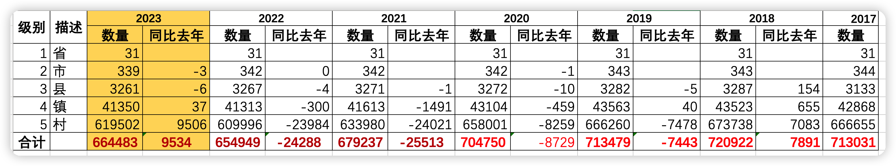
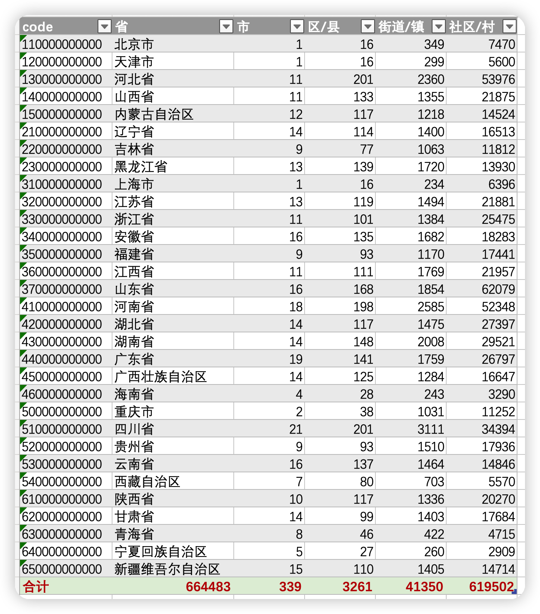

# 2023年中国全国5级行政区划（省、市、县、镇、村）

* 数据来源 中华人民共和国国家统计局 http://www.stats.gov.cn/tjsj/tjbz/tjyqhdmhcxhfdm/2022/index.html
* 最新数据量 664483 （2022年10月31日）
* CSV格式 area_code_2023.csv.gz
* SQL格式 area_code_2023.sql.gz
* JSON格式 单JSON格式太大就不生成了
* 建议级联操作，数据量确实太大了
* 级别
  * 1级：省、直辖市、自治区
  * 2级：地级市
  * 3级：市辖区、县（旗）、县级市、自治县（自治旗）、特区、林区
  * 4级：镇、乡、民族乡、县辖区、街道
  * 5级：村、居委会





# 2009 - 2023 年数据对比

<table>
    <tr>
        <th>代码</th>
        <th>省份</th>
        <th>市/2009</th>
        <th>市/2023</th>
        <th>区/县/2009</th>
        <th>区/县/2023</th>
        <th>街道/镇/2009</th>
        <th>街道/镇/2023</th>
        <th>社区/村/2009</th>
        <th>社区/村/2023</th>
    </tr>
    <tr>
        <td>110000000000</td>
        <td>北京市</td>
        <td>2</td>
        <td>1 (-1)</td>
        <td>18</td>
        <td>16 (-2)</td>
        <td>321</td>
        <td>349 (+28)</td>
        <td>6614</td>
        <td>7470 (+856)</td>
    </tr>
    <tr>
        <td>120000000000</td>
        <td>天津市</td>
        <td>2</td>
        <td>1 (-1)</td>
        <td>18</td>
        <td>16 (-2)</td>
        <td>277</td>
        <td>299 (+22)</td>
        <td>5349</td>
        <td>5600 (+251)</td>
    </tr>
    <tr>
        <td>130000000000</td>
        <td>河北省</td>
        <td>11</td>
        <td>11 (+0)</td>
        <td>183</td>
        <td>201 (+18)</td>
        <td>2285</td>
        <td>2360 (+75)</td>
        <td>52356</td>
        <td>53976 (+1620)</td>
    </tr>
    <tr>
        <td>140000000000</td>
        <td>山西省</td>
        <td>11</td>
        <td>11 (+0)</td>
        <td>130</td>
        <td>133 (+3)</td>
        <td>1449</td>
        <td>1355 (-94)</td>
        <td>30018</td>
        <td>21875 (-8143)</td>
    </tr>
    <tr>
        <td>150000000000</td>
        <td>内蒙古自治区</td>
        <td>12</td>
        <td>12 (+0)</td>
        <td>110</td>
        <td>117 (+7)</td>
        <td>1050</td>
        <td>1218 (+168)</td>
        <td>14540</td>
        <td>14524 (-16)</td>
    </tr>
    <tr>
        <td>210000000000</td>
        <td>辽宁省</td>
        <td>14</td>
        <td>14 (+0)</td>
        <td>114</td>
        <td>114 (+0)</td>
        <td>1565</td>
        <td>1400 (-165)</td>
        <td>15938</td>
        <td>16513 (+575)</td>
    </tr>
    <tr>
        <td>220000000000</td>
        <td>吉林省</td>
        <td>9</td>
        <td>9 (+0)</td>
        <td>68</td>
        <td>77 (+9)</td>
        <td>1036</td>
        <td>1063 (+27)</td>
        <td>11616</td>
        <td>11812 (+196)</td>
    </tr>
    <tr>
        <td>230000000000</td>
        <td>黑龙江省</td>
        <td>13</td>
        <td>13 (+0)</td>
        <td>140</td>
        <td>139 (-1)</td>
        <td>1835</td>
        <td>1720 (-115)</td>
        <td>14212</td>
        <td>13930 (-282)</td>
    </tr>
    <tr>
        <td>310000000000</td>
        <td>上海市</td>
        <td>2</td>
        <td>1 (-1)</td>
        <td>18</td>
        <td>16 (-2)</td>
        <td>232</td>
        <td>234 (+2)</td>
        <td>5376</td>
        <td>6396 (+1020)</td>
    </tr>
    <tr>
        <td>320000000000</td>
        <td>江苏省</td>
        <td>13</td>
        <td>13 (+0)</td>
        <td>119</td>
        <td>119 (+0)</td>
        <td>1628</td>
        <td>1494 (-134)</td>
        <td>22478</td>
        <td>21881 (-597)</td>
    </tr>
    <tr>
        <td>330000000000</td>
        <td>浙江省</td>
        <td>11</td>
        <td>11 (+0)</td>
        <td>101</td>
        <td>101 (+0)</td>
        <td>1533</td>
        <td>1384 (-149)</td>
        <td>34118</td>
        <td>25475 (-8643)</td>
    </tr>
    <tr>
        <td>340000000000</td>
        <td>安徽省</td>
        <td>17</td>
        <td>16 (-1)</td>
        <td>122</td>
        <td>135 (+13)</td>
        <td>1611</td>
        <td>1682 (+71)</td>
        <td>19052</td>
        <td>18283 (-769)</td>
    </tr>
    <tr>
        <td>350000000000</td>
        <td>福建省</td>
        <td>9</td>
        <td>9 (+0)</td>
        <td>94</td>
        <td>93 (-1)</td>
        <td>1180</td>
        <td>1170 (-10)</td>
        <td>16814</td>
        <td>17441 (+627)</td>
    </tr>
    <tr>
        <td>360000000000</td>
        <td>江西省</td>
        <td>11</td>
        <td>11 (+0)</td>
        <td>110</td>
        <td>111 (+1)</td>
        <td>1775</td>
        <td>1769 (-6)</td>
        <td>20522</td>
        <td>21957 (+1435)</td>
    </tr>
    <tr>
        <td>370000000000</td>
        <td>山东省</td>
        <td>17</td>
        <td>16 (-1)</td>
        <td>157</td>
        <td>168 (+11)</td>
        <td>1885</td>
        <td>1854 (-31)</td>
        <td>83079</td>
        <td>62079 (-21000)</td>
    </tr>
    <tr>
        <td>410000000000</td>
        <td>河南省</td>
        <td>18</td>
        <td>18 (+0)</td>
        <td>176</td>
        <td>198 (+22)</td>
        <td>2486</td>
        <td>2585 (+99)</td>
        <td>51296</td>
        <td>52348 (+1052)</td>
    </tr>
    <tr>
        <td>420000000000</td>
        <td>湖北省</td>
        <td>14</td>
        <td>14 (+0)</td>
        <td>115</td>
        <td>117 (+2)</td>
        <td>1484</td>
        <td>1475 (-9)</td>
        <td>30457</td>
        <td>27397 (-3060)</td>
    </tr>
    <tr>
        <td>430000000000</td>
        <td>湖南省</td>
        <td>14</td>
        <td>14 (+0)</td>
        <td>135</td>
        <td>148 (+13)</td>
        <td>2509</td>
        <td>2008 (-501)</td>
        <td>47071</td>
        <td>29521 (-17550)</td>
    </tr>
    <tr>
        <td>440000000000</td>
        <td>广东省</td>
        <td>21</td>
        <td>19 (-2)</td>
        <td>140</td>
        <td>141 (+1)</td>
        <td>1768</td>
        <td>1759 (-9)</td>
        <td>26037</td>
        <td>26797 (+760)</td>
    </tr>
    <tr>
        <td>450000000000</td>
        <td>广西壮族自治区</td>
        <td>14</td>
        <td>14 (+0)</td>
        <td>124</td>
        <td>125 (+1)</td>
        <td>1272</td>
        <td>1284 (+12)</td>
        <td>16260</td>
        <td>16647 (+387)</td>
    </tr>
    <tr>
        <td>460000000000</td>
        <td>海南省</td>
        <td>3</td>
        <td>4 (+1)</td>
        <td>25</td>
        <td>28 (+3)</td>
        <td>337</td>
        <td>243 (-94)</td>
        <td>6341</td>
        <td>3290 (-3051)</td>
    </tr>
    <tr>
        <td>500000000000</td>
        <td>重庆市</td>
        <td>2</td>
        <td>2 (+0)</td>
        <td>40</td>
        <td>38 (-2)</td>
        <td>1012</td>
        <td>1031 (+19)</td>
        <td>10918</td>
        <td>11252 (+334)</td>
    </tr>
    <tr>
        <td>510000000000</td>
        <td>四川省</td>
        <td>21</td>
        <td>21 (+0)</td>
        <td>199</td>
        <td>201 (+2)</td>
        <td>4675</td>
        <td>3111 (-1564)</td>
        <td>53539</td>
        <td>34394 (-19145)</td>
    </tr>
    <tr>
        <td>520000000000</td>
        <td>贵州省</td>
        <td>9</td>
        <td>9 (+0)</td>
        <td>91</td>
        <td>93 (+2)</td>
        <td>1558</td>
        <td>1510 (-48)</td>
        <td>18923</td>
        <td>17936 (-987)</td>
    </tr>
    <tr>
        <td>530000000000</td>
        <td>云南省</td>
        <td>16</td>
        <td>16 (+0)</td>
        <td>137</td>
        <td>137 (+0)</td>
        <td>1393</td>
        <td>1464 (+71)</td>
        <td>14157</td>
        <td>14846 (+689)</td>
    </tr>
    <tr>
        <td>540000000000</td>
        <td>西藏自治区</td>
        <td>7</td>
        <td>7 (+0)</td>
        <td>74</td>
        <td>80 (+6)</td>
        <td>692</td>
        <td>703 (+11)</td>
        <td>5455</td>
        <td>5570 (+115)</td>
    </tr>
    <tr>
        <td>610000000000</td>
        <td>陕西省</td>
        <td>10</td>
        <td>10 (+0)</td>
        <td>117</td>
        <td>117 (+0)</td>
        <td>1763</td>
        <td>1336 (-427)</td>
        <td>29078</td>
        <td>20270 (-8808)</td>
    </tr>
    <tr>
        <td>620000000000</td>
        <td>甘肃省</td>
        <td>14</td>
        <td>14 (+0)</td>
        <td>98</td>
        <td>99 (+1)</td>
        <td>1409</td>
        <td>1403 (-6)</td>
        <td>17386</td>
        <td>17684 (+298)</td>
    </tr>
    <tr>
        <td>630000000000</td>
        <td>青海省</td>
        <td>8</td>
        <td>8 (+0)</td>
        <td>44</td>
        <td>46 (+2)</td>
        <td>413</td>
        <td>422 (+9)</td>
        <td>4572</td>
        <td>4715 (+143)</td>
    </tr>
    <tr>
        <td>640000000000</td>
        <td>宁夏回族自治区</td>
        <td>5</td>
        <td>5 (+0)</td>
        <td>27</td>
        <td>27 (+0)</td>
        <td>259</td>
        <td>260 (+1)</td>
        <td>2842</td>
        <td>2909 (+67)</td>
    </tr>
    <tr>
        <td>650000000000</td>
        <td>新疆维吾尔自治区</td>
        <td>15</td>
        <td>15 (+0)</td>
        <td>100</td>
        <td>110 (+10)</td>
        <td>1358</td>
        <td>1405 (+47)</td>
        <td>13693</td>
        <td>14714 (+1021)</td>
    </tr>
</table>

## 大量村镇合并

例如：

`略`

----


## CSV格式

* code,name,level,pcode
* level: 省1，市2，县3，镇4，村5
* code: 12位，省2位，市2位，县2位，镇3位，村3位
* pcode: 直接父级别的code

文本内容

```bash
$ gzcat area_code_2023.csv.gz |wc -l
  664483

$ gzcat area_code_2022.csv.gz |head
110101001001,多福巷社区居委会,5,110101001000
110101001002,银闸社区居委会,5,110101001000
110101001005,东厂社区居委会,5,110101001000
110101001006,智德社区居委会,5,110101001000
110101001007,南池子社区居委会,5,110101001000
110101001009,灯市口社区居委会,5,110101001000
110101001010,正义路社区居委会,5,110101001000
110101001013,台基厂社区居委会,5,110101001000
110101001014,韶九社区居委会,5,110101001000
110101001015,王府井社区居委会,5,110101001000
```

## SQL 格式

> $ gzcat area_code_2023.sql.gz |head -n 34

```sql
-- MariaDB dump 10.18  Distrib 10.5.8-MariaDB, for Linux ()
--
-- Host: localhost    Database: china_area
-- ------------------------------------------------------
-- Server version 10.5.8-MariaDB-log

/*!40101 SET @OLD_CHARACTER_SET_CLIENT=@@CHARACTER_SET_CLIENT */;
/*!40101 SET @OLD_CHARACTER_SET_RESULTS=@@CHARACTER_SET_RESULTS */;
/*!40101 SET @OLD_COLLATION_CONNECTION=@@COLLATION_CONNECTION */;
/*!40101 SET NAMES utf8mb4 */;
/*!40103 SET @OLD_TIME_ZONE=@@TIME_ZONE */;
/*!40103 SET TIME_ZONE='+00:00' */;
/*!40014 SET @OLD_UNIQUE_CHECKS=@@UNIQUE_CHECKS, UNIQUE_CHECKS=0 */;
/*!40014 SET @OLD_FOREIGN_KEY_CHECKS=@@FOREIGN_KEY_CHECKS, FOREIGN_KEY_CHECKS=0 */;
/*!40101 SET @OLD_SQL_MODE=@@SQL_MODE, SQL_MODE='NO_AUTO_VALUE_ON_ZERO' */;
/*!40111 SET @OLD_SQL_NOTES=@@SQL_NOTES, SQL_NOTES=0 */;

--
-- Table structure for table `area_code_2023`
--

DROP TABLE IF EXISTS `area_code_2023`;
/*!40101 SET @saved_cs_client     = @@character_set_client */;
/*!40101 SET character_set_client = utf8 */;
CREATE TABLE `area_code_2023` (
  `code` bigint(12) unsigned NOT NULL COMMENT '区划代码',
  `name` varchar(128) NOT NULL DEFAULT '' COMMENT '名称',
  `level` tinyint(1) NOT NULL COMMENT '级别1-5,省市县镇村',
  `pcode` bigint(12) DEFAULT NULL COMMENT '父级区划代码',
  PRIMARY KEY (`code`),
  KEY `name` (`name`),
  KEY `level` (`level`),
  KEY `pcode` (`pcode`)
) ENGINE=InnoDB DEFAULT CHARSET=utf8mb4;

```

> 创建视图 area_index_2023

```sql
CREATE VIEW area_index_2023 AS
    SELECT a.code,e.name AS province,d.name AS city  ,c.name AS county,b.name AS town,a.name AS villagetr
    FROM area_code_2023 a
        JOIN area_code_2023 b ON a.level=5 AND b.level=4 AND a.pcode=b.code
        JOIN area_code_2023 c ON b.pcode=c.code
        JOIN area_code_2023 d ON c.pcode=d.code
        JOIN area_code_2023 e ON d.pcode=e.code
    ORDER BY a.code
```

查询几条记录

> SELECT * FROM area_index_2023 LIMIT 10

```text
+--------------+-----------+-----------+-----------+-----------------+--------------------------+
| code         | province  | city      | county    | town            | villagetr                |
+--------------+-----------+-----------+-----------+-----------------+--------------------------+
| 110101001001 | 北京市    | 市辖区    | 东城区    | 东华门街道      | 多福巷社区居委会         |
| 110101001002 | 北京市    | 市辖区    | 东城区    | 东华门街道      | 银闸社区居委会           |
| 110101001005 | 北京市    | 市辖区    | 东城区    | 东华门街道      | 东厂社区居委会           |
| 110101001006 | 北京市    | 市辖区    | 东城区    | 东华门街道      | 智德社区居委会           |
| 110101001007 | 北京市    | 市辖区    | 东城区    | 东华门街道      | 南池子社区居委会         |
| 110101001009 | 北京市    | 市辖区    | 东城区    | 东华门街道      | 灯市口社区居委会         |
| 110101001010 | 北京市    | 市辖区    | 东城区    | 东华门街道      | 正义路社区居委会         |
| 110101001013 | 北京市    | 市辖区    | 东城区    | 东华门街道      | 台基厂社区居委会         |
| 110101001014 | 北京市    | 市辖区    | 东城区    | 东华门街道      | 韶九社区居委会           |
| 110101001015 | 北京市    | 市辖区    | 东城区    | 东华门街道      | 王府井社区居委会         |
+--------------+-----------+-----------+-----------+-----------------+--------------------------+
```

## 三级区划的JSON格式

JSON格式，适合web端js加载。


```json
[
  {
    "code": 110000000000,
    "name": "北京市",
    "level": 1,
    "pcode": 0,
    "children": [
      {
        "code": 110100000000,
        "name": "市辖区",
        "level": 2,
        "pcode": 110000000000,
        "children": [
          {
            "code": 110101000000,
            "name": "东城区",
            "level": 3,
            "pcode": 110100000000
          },
          {
            "code": 110102000000,
            "name": "西城区",
            "level": 3,
            "pcode": 110100000000
          }
        ]
      }
    ]
  }
]
```

## 文件列表

- [area_code_2023.csv.gz](area_code_2023.csv.gz)
- [area_code_2023.sql.gz](area_code_2023.sql.gz)
- [area_code_2023.json](area_code_2023.json)